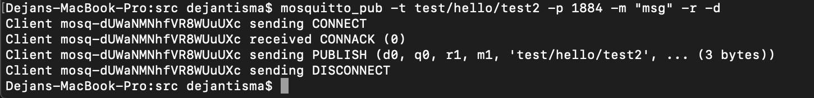
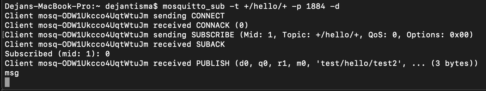
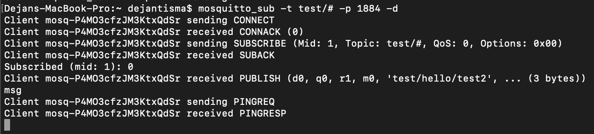
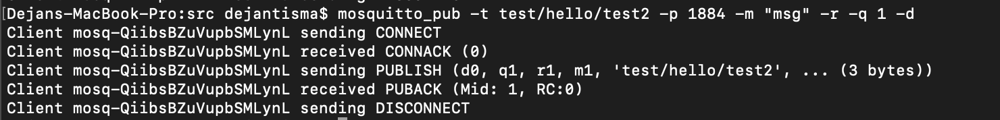
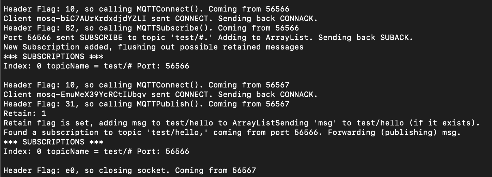

## COS 460/540 - Computer Networks
# Project : MQTT Server

# Dejan Tisma

This project is written in Java mostly on Windows 10. However, submitted and tested on macOS.

## __How to compile__
1. Clone or download this repo
2. Change directory into the /src/ folder
    ```
    Dejans-MacBook-Pro:project-3-dejantisma dejantisma$ ls
    PLAYBOOK.md	README.md	imgs		src
    Dejans-MacBook-Pro:project-3-dejantisma dejantisma$ cd src
    ```
3. Compile MQTTServer.java using javac
    ```
    Dejans-MacBook-Pro:src dejantisma$ javac MQTTServer.java
    ```

## __How to run__

&nbsp;&nbsp;&nbsp;&nbsp;&nbsp; Simply run

 ```
    java MQTTServer [port]
```
&nbsp;&nbsp;&nbsp;&nbsp;&nbsp; where [ ] is optional and if port is not specified, the default, 1884, is used.


## My experience with this project

Big takeaway:
- Using Wireshark to track packets
- Using stream objects, specifically DataInput(and Output)Stream, to read, interpret, and write data to clients.
- Using threads for multiple connections and sending data to clients without being backed up.
- @Override equals()

I initially started to use PrintWriter and BufferedReader for writing and reading, but upon some issues, I quickly learned we were only concerning ourselves with bytes and these classes wouldn't be necessary.

Much of my process was using `mosquitto_sub` and `mosquitto_pub` on their default port on my machine and searching 'mqtt' in Wireshark to track the requests and see what data was being sent back and forth. Then try to apply it to my program.

At first, I was confused because I would send packets to my server but I couldn't find them in Wireshark, soon enough I realized they were wrapped in TCP/IP because of the sockets we were using in our program. There was also some extra stuff so I just had to pick from the packets that had length and were going to and from the port I was working with.

At one point when I would have a client subscribe to a topic, and I would quit the client (control+C), a publish that would go to the client would hang up the whole server because the client was unresponsive. To fix this, I used threads not only for clients to connect but for the actual output of data over sockets. I think this was the idea of 'subscriptions are asynchronous and that data will be published back to the client at any time.'

I overrided my Subscription and PublishMessage equals() methods to account for wildcards in topic names. It was a little messy (honestly as was the rest of my code, I have some casting, ints, bytes, etc.). May rewrite it for project 4. 


Few things not fully functional:
- Wildcards aren't perfect, I didn't text extensively but I think simple ones work (shown in demo) but combining + and # like +/test/# isn't functional. 
- Publishing with QOS 2 isn't functional. You see it commented out in MQTTPublish(), I can probably get it working before project 4.


## Demo

Publish: The -r means it will retain this message for future subscribers. So if any client subscribes to `test/hello/test2` or any possible wildcard variations, they will get the message "msg." The -d stands for debug and just shows what the client is sending and receiving (shows my server sending CONNACK)



Now, I opened another terminal window and subscribed to `+/hello/+`, and you can see the client received the retained message. 



And so forth.. with `test/#` (this time showing PINGREQ and PINGRESP as well)



And publishing with QOS 1 (receiving the PUBACK)



Lastly, program (server console output). This was useful for debugging and knowing what my server was doing. 

